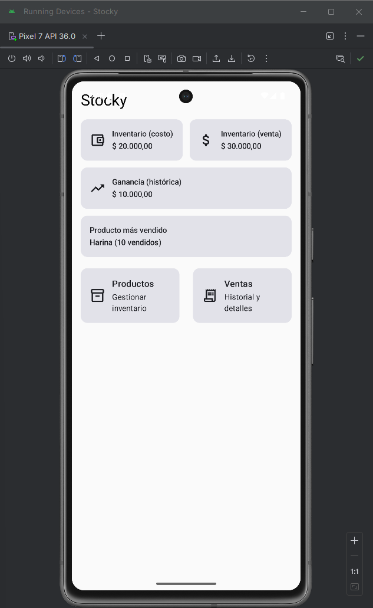
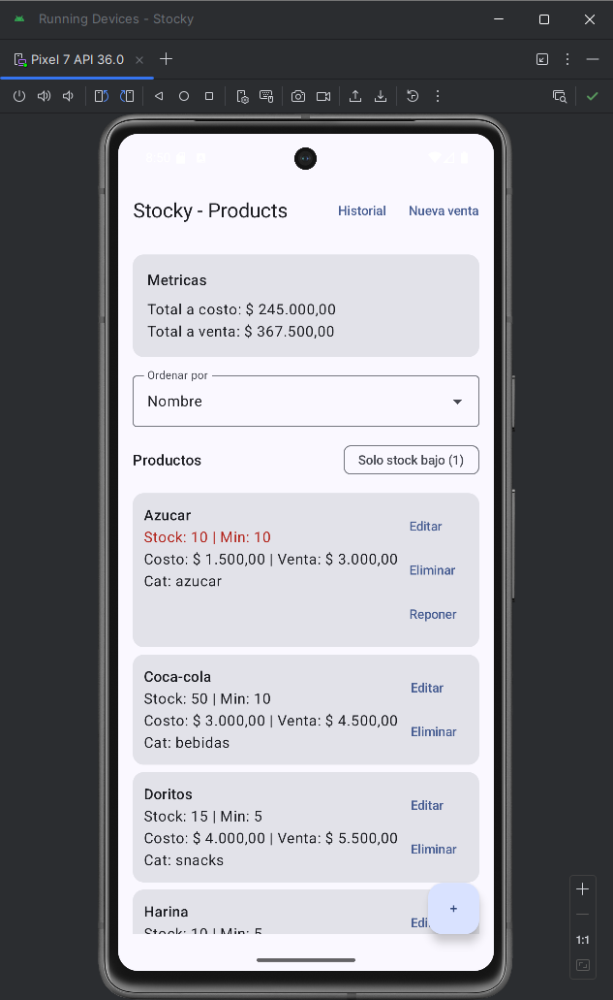
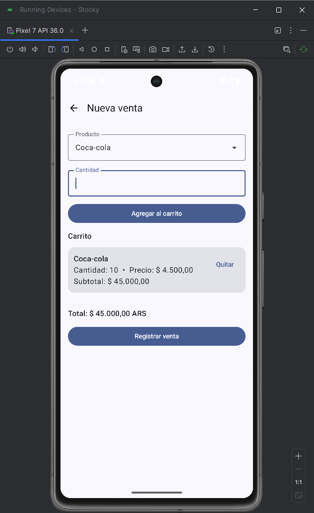
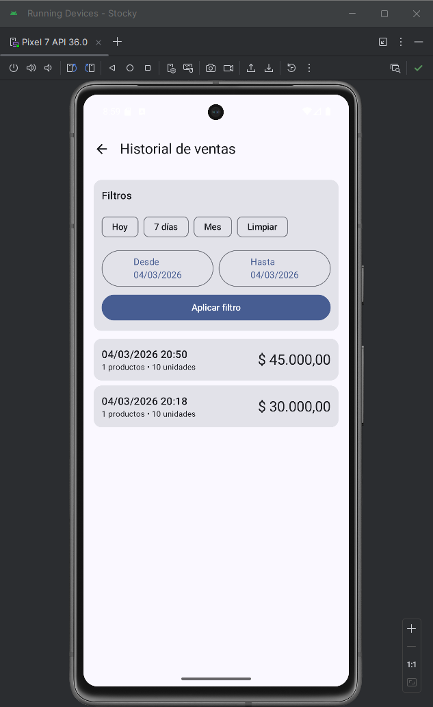
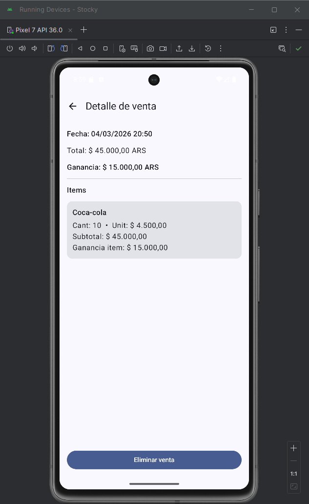

# Stocky 📦

Stocky es una aplicación Android para gestión de inventario y ventas diseñada para pequeños negocios.

Permite administrar productos, registrar ventas, controlar stock y visualizar métricas clave del negocio.

Este proyecto fue desarrollado como práctica avanzada de Android utilizando Kotlin, Jetpack Compose y arquitectura MVVM.

---

# Features

• Gestión de productos (crear, editar, eliminar)  
• Control de stock mínimo  
• Registro de ventas con múltiples productos  
• Descuento automático de stock  
• Historial de ventas con filtros por fecha  
• Detalle de cada venta  
• Cálculo de ganancia histórica  
• Dashboard con métricas del negocio  
• Indicador de productos con stock bajo  
• Restock rápido desde la lista de productos  
• UI moderna con Jetpack Compose

---

# Arquitectura

El proyecto utiliza arquitectura **MVVM** con una separación clara de responsabilidades.

UI (Compose)
↓
ViewModel
↓
Repository
↓
Room Database

Principales tecnologías utilizadas:

- Kotlin
- Jetpack Compose
- Room Database
- Coroutines
- Flow
- Navigation Compose
- ConstraintLayout Compose
- Material 3

---

# Screenshots

### Home

### Products

### New Sale

### Sales History

### Detail

---

# Qué aprendí construyendo este proyecto

- Arquitectura MVVM en Android
- Manejo de estado con StateFlow
- Uso de Room con transacciones
- Modelado de entidades y relaciones
- Manejo de navegación en Compose
- Diseño de UI responsive con ConstraintLayout
- Manejo de errores de negocio (ej: stock insuficiente)

---

# Próximas mejoras

• Exportar ventas a Excel  
• Dashboard con gráficos  
• Backup en la nube  
• Soporte multi-negocio

---

# Autor

Ignacio Herner  
Android Developer (Kotlin)
Linkedin: https://www.linkedin.com/in/ignacioherner/
